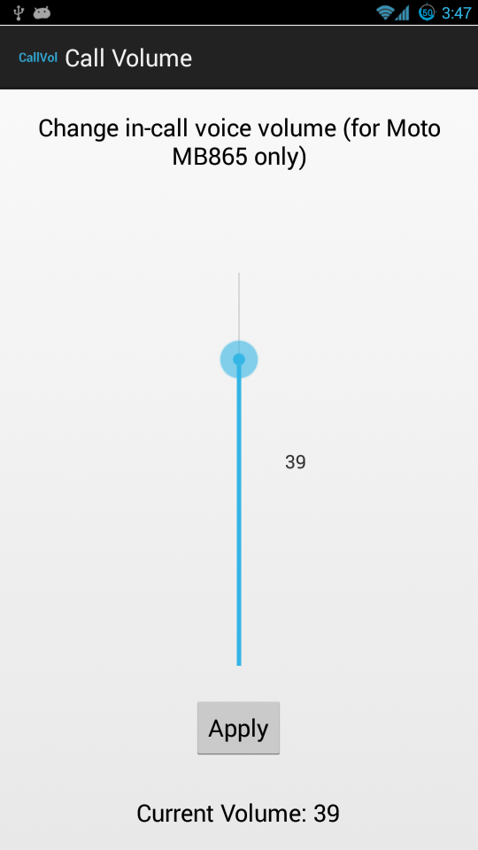

caifatcmd
=========

Send AT commands to STE modems over a CAIF socket.

The STE modem in the Motorola Atrix 2 (MB865, edison) modem takes in AT commands to adjust the voice call volume.
Audio libs in custom ROMs for the phone did not contain the code to send those AT commands.
Hence this app which will send the appropriate AT commands via [CAIF](http://en.wikipedia.org/wiki/CAIF) socket, wrapped with a GUI.

**This program needs root permission**. It is needed to open the CAIF type of socket to talk to the modem.

Screenshot (of the only activity in the app):

Details about at-cmd binary
===========================
The steps below assume android SDK and NDK are installed on the host computer.

Instructions to build and run (> is the shell prompt on the host, # is the ADB su prompt):
* Checkout this tree.
* > cd jni
* > ndk-build
* > ndk-build post_build
* Above step outputs the binary libs/armeabi/at-cmd and copies it to app's lib directory as libfake.so
* > adb push libs/armeabi/at-cmd /data/local
* > adb shell
* Above command should open a root shell on the phone
* # cd /data/local
* # chmod 755 at-cmd
* # ./at-cmd N
* The N passed to the binary must be an integer between 5 and 40 (as tested by me)
* 5 is the loudest, 40 is the quietest (inverted)
* The binary sends the AT command: AT*EADVOL=-N to the phone's modem
